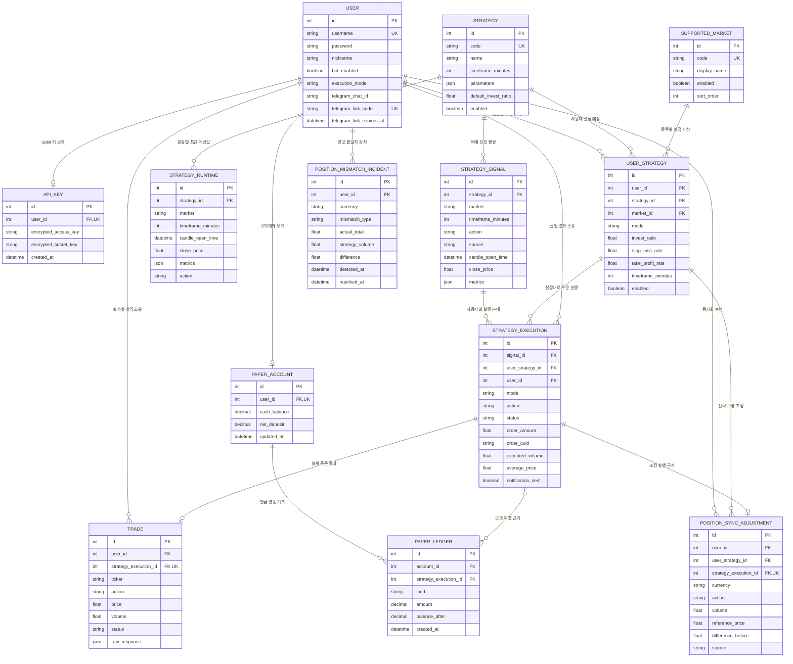

# SignalTrade 프로젝트 구조와 사용 방법

## 1. 서비스 구성

SignalTrade는 Docker Compose에서 네 개의 상시 컨테이너와 한 개의 일회성 마이그레이션 컨테이너로 실행된다.

```text
브라우저
   │ HTTP
   ▼
React + Vite(frontend) ── HTTP ── FastAPI + Uvicorn(backend)
                                      │
                                      ▼
                                  PostgreSQL(db)
                                      ▲
                           ┌──────────┴──────────┐
                           │                     │
                   Alembic migrate      Python strategy-worker
                    (시작 전 실행)          │              │
                                           ▼              ▼
                                    Upbit WebSocket/API  Telegram API
```

| 컨테이너 | 역할 |
|---|---|
| `frontend` | 로그인, 투자 모드 선택, 전략 설정, 계좌와 실행 내역 표시 |
| `backend` | FastAPI HTTP API, 인증, 설정 저장, 잔고 및 기록 조회 |
| `strategy-worker` | 시세 수신, 분봉 생성, 전략 계산, 주문, Telegram과 반복 감시 |
| `db` | 사용자, 전략 설정, 신호, 체결, 포지션 계산 근거와 감사 기록 저장 |
| `migrate` | 시작 시 `alembic upgrade head`를 실행하고 정상 완료 후 종료 |

`backend`와 `strategy-worker`는 같은 Python 이미지와 코드를 사용하지만 실행 명령이 다르다.

```text
backend         → uvicorn app.main:app
strategy-worker → python -m app.workers.runtime
migrate         → alembic upgrade head
```

## 2. 디렉토리 구조

```text
.
├── .github/workflows/ci.yml       # GitHub Actions CI
├── backend/
│   ├── app/
│   │   ├── api/                   # FastAPI endpoint
│   │   ├── core/                  # 설정, DB 연결
│   │   ├── models/                # SQLAlchemy 테이블 모델
│   │   ├── schemas/               # 요청·응답 검증 모델
│   │   ├── services/              # 전략, 주문, Upbit, Telegram 비즈니스 로직
│   │   └── workers/               # strategy-worker 실행 진입점
│   ├── alembic/                   # DB 스키마 버전과 마이그레이션 리비전
│   ├── alembic.ini                # Alembic 실행 설정
│   └── tests/                     # pytest
├── frontend/
│   └── src/
│       ├── api/                   # FastAPI 호출
│       ├── components/            # 대시보드와 레이아웃 컴포넌트
│       ├── hooks/                 # polling 등 공통 hook
│       ├── pages/                 # 로그인, 가입, 통합 홈, 투자 대시보드
│       └── utils/                 # 표시 형식과 전략 지표 변환
├── docker-compose.yml
├── README.md
└── SETUP.md
```

## 3. 주요 데이터 흐름

### 회원가입

```text
사용자 정보와 Upbit Key 입력
→ FastAPI가 Upbit에 Key 유효성 확인
→ Access/Secret Key 암호화
→ user, api_key 테이블 저장
```

### 전략 설정

```text
모의 또는 실전 모드 선택
→ 지원 종목 선택
→ 전략 선택
→ 분봉·투자 비율·손절·익절 설정
→ user_strategy 테이블에 사용자·모드·종목·전략 조합별 저장
```

모의와 실전은 별도 DB를 만드는 대신 `user_strategy.mode`로 분리한다. 같은 사용자와 같은 전략이어도 모드와 종목별 설정 및 실행 기록은 독립적이다. 전략 계산 공식은 `strategy`, 지원 종목은 `supported_market`, 실제 사용자 설정 조합은 `user_strategy`가 담당하므로 종목이 늘어나도 DB 컬럼을 추가하지 않는다.

현재 지원 종목은 `BTC, ETH, XRP, SOL, DOGE, TRX`의 6개 KRW 마켓이다. 목록은 거래대금 순위에 따라 자동 교체하지 않고 고정 카탈로그로 관리해 기존 포지션과 전략 설정의 연결을 보호한다. 제외된 종목은 과거 설정과 체결 기록의 참조 무결성을 위해 DB 행을 삭제하지 않고 비활성화한다.

투자 비율은 주문 시점의 남은 현금 비율이 아니라 전체 운용자산에서 각 전략에 배정할 최대 비율이다.

```text
전략 배정 한도 = 전체 운용자산 × 전략 투자 비율
매수 가능 금액 = min(전략 배정 한도 - 현재 전략 포지션 평가액, 가용 현금)
```

모의 전체 운용자산은 `모의 현금 + 모의 전략 포지션 평가액`, 실전 전체 운용자산은 `Upbit 가용 KRW + SignalTrade가 관리하는 실전 전략 포지션 평가액`으로 계산한다. 사용자가 Upbit에서 직접 보유한 미배정 코인은 전략 예산에 포함하지 않는다.

배정 비율은 현금을 미리 분리해 예약하는 값이 아니라 신규 매수 시점의 최대 한도다. 실제 주문은 가용 현금을 넘을 수 없고 수수료 때문에 배정 한도보다 조금 작아질 수 있다. 매수 후 가격 변동으로 전략 비중이 설정값보다 높거나 낮아져도 자동 리밸런싱하거나 강제 매도하지 않으며, 기존과 동일하게 해당 전략의 매도 신호·손절·익절·수동 매도로 청산한다. 현재는 전략별 포지션 보유 중 추가 매수를 차단하므로 배정 한도 차감 계산은 향후 분할 매수를 허용할 때도 그대로 사용할 수 있다.

#### 운용자산 갱신 시점

전체 운용자산은 고정된 최초 투자금이 아니다. 새로운 매수 신호를 처리할 때 현재 계좌와 포지션을 기준으로 다시 계산하므로 입출금, 이전 체결, 손익과 수수료가 다음 주문의 전략별 한도에 반영된다.

```text
모의 전체 운용자산
= 현재 모의 현금
 + 모든 모의 전략 포지션 평가액

실전 전체 운용자산
= Upbit에서 매수 직전에 조회한 가용 KRW
 + SignalTrade 실전 전략 포지션 평가액
```

모의계좌 입금·출금과 모의 매수·매도는 DB의 현금 및 원장에 반영된다. 실전 원화 입금·출금과 자동매매 체결은 Upbit 잔고와 `strategy_execution` 기록을 통해 다음 계산에 반영된다.

포지션 평가에는 초 단위 체결가를 별도로 저장하지 않고 전략 엔진이 가장 최근 계산한 해당 분봉의 종가를 사용한다. 따라서 여기서 말하는 갱신은 화면이 매 순간 총액을 다시 쓰는 방식이 아니라, 주문 판단 시점에 최신 계좌 정보와 최근 전략 계산값으로 새로운 스냅샷을 만드는 방식이다.

사용자가 Upbit 앱에서 직접 원화를 입금하거나 출금하면 다음 실전 매수 검사에 반영된다. 직접 매수한 미배정 코인은 전략 운용자산에서 제외하며, SignalTrade가 관리하던 코인을 직접 매도한 경우에는 실제 잔고와 내부 포지션 기록이 달라질 수 있다. 이때는 잔고 불일치 알림을 확인하고 웹 또는 Telegram `/sync`로 전략 기록을 맞춘 뒤 다음 주문을 진행한다.

### 자동매매

```text
Upbit WebSocket 체결 수신
→ worker가 사용자 설정 분봉 생성
→ 전략 지표 계산
→ 마감 봉에서 신호 확정
→ strategy_signal 저장
→ 사용자별 주문 사전 검사
→ 모의계좌 반영 또는 Upbit 주문
→ strategy_execution, trade 저장
→ Telegram 알림
```

### 포지션

현재 포지션을 별도 숫자로 덮어쓰지 않는다. 전략별 성공 매수 체결량에서 성공 매도 체결량을 차감해 현재 수량과 평균 매수가를 계산한다.

```text
성공 매수 실행 합계 - 성공 매도 실행 합계 = 전략의 현재 포지션
```

이 방식은 어떤 주문 때문에 현재 수량이 만들어졌는지 추적할 수 있다는 장점이 있다.

### 외부 거래 동기화

사용자가 Upbit 앱에서 직접 거래하면 실제 잔고와 SignalTrade 전략 기록이 달라질 수 있다.

```text
Upbit 실제 수량
↕ 비교
실전 전략 기록 수량 합계
```

웹의 보유 잔고 화면이나 Telegram `/sync`에서 차이를 확인하고 특정 전략에 배정 또는 차감한다. 이 작업은 실제 Upbit 주문을 만들지 않으며 `position_sync_adjustment`에 감사 기록을 남긴다.

## 4. 전략 목록

| 전략 | 기본 원리 |
|---|---|
| 이동평균 교차 | 단기 SMA와 장기 SMA의 상향·하향 교차 |
| RSI 반전 | 과매도·과매수 구간에서 기준선 복귀 |
| MACD 크로스 | MACD선과 Signal선의 상향·하향 교차 |
| 볼린저 밴드 회귀 | 밴드 이탈 후 내부 복귀 |
| 돈치안 채널 돌파 | 이전 구간 최고가·최저가 돌파 |

지원 분봉은 `1, 3, 5, 10, 30, 60, 240분`이다.

## 5. 로컬 실행

### 환경변수

```bash
cp .env.example .env
python3 -c "import base64,secrets; print(base64.urlsafe_b64encode(secrets.token_bytes(32)).decode())"
```

출력된 키를 `.env`의 `MASTER_ENCRYPTION_KEY`에 저장한다. Telegram을 사용할 경우 BotFather가 발급한 토큰과 봇 사용자명도 입력한다.

### 컨테이너 실행

```bash
docker compose up --build -d
docker compose ps
curl http://localhost:8000/health
```

브라우저 접속 주소:

```text
http://localhost:5173
```

### 검사

```bash
docker compose exec backend python -m pytest -q
docker compose exec frontend npm run lint
docker compose exec frontend npm run build
docker compose build
```

### 로그

```bash
docker compose logs -f backend
docker compose logs -f strategy-worker
docker compose logs -f frontend
docker compose logs -f db
```

## 6. 사용자 사용 순서

1. Upbit에서 조회·주문 권한과 허용 IP를 설정한 API Key를 발급한다.
2. SignalTrade에서 회원가입하며 Access Key와 Secret Key를 등록한다.
3. 로그인 후 통합 홈에서 모의투자와 실전투자의 핵심 상태를 확인한다.
4. 사이드바 또는 요약 카드에서 모의투자/실전투자 관리 화면으로 이동한다.
5. 선택한 종목·전략 조합별 분봉, 투자 비율, 손절률과 목표 수익률을 설정한다.
6. 모의투자에서 테스트 신호와 모의계좌 변화를 검증한다.
7. Telegram 연동 코드를 발급해 `/start 코드`를 봇에 전송한다.
8. 실전투자를 사용할 때 서버의 `LIVE_TRADING_ENABLED=true` 여부를 확인한다.
9. 전략 신호, 실행 내역, 계좌와 Telegram 알림을 확인한다.
10. 외부 거래로 잔고 차이가 생기면 웹 또는 `/sync`에서 전략 기록을 맞춘다.

## 7. 주요 환경변수

| 환경변수 | 의미 |
|---|---|
| `DATABASE_URL` | PostgreSQL 연결 문자열 |
| `SECRET_KEY` | JWT 서명 키 |
| `MASTER_ENCRYPTION_KEY` | Upbit API Key 암호화 키 |
| `LIVE_TRADING_ENABLED` | 실제 주문 전역 안전 스위치 |
| `WATCH_MARKETS` | worker가 구독할 Upbit 마켓 |
| `STRATEGY_REFRESH_SECONDS` | 전략 설정 재조회 주기 |
| `TELEGRAM_BOT_TOKEN` | Telegram Bot API 토큰 |
| `TELEGRAM_BOT_USERNAME` | Telegram 봇 사용자명 |
| `POSITION_RECONCILIATION_SECONDS` | 실제 잔고 불일치 검사 주기 |
| `STALE_EXECUTION_SECONDS` | 미완료 주문 복구 판단 시간 |

## 8. DB 테이블 구조

아래 ER 다이어그램은 SQLAlchemy 모델에 선언된 실제 외래키를 기준으로 작성했다. GitHub에서 이 문서를 열면 각 테이블과 관계가 다이어그램으로 렌더링된다.



### 테이블 그룹별 역할

| 구분 | 테이블 | 저장 내용 |
|---|---|---|
| 사용자·외부 연결 | `user`, `api_key` | 계정, 실행 모드, Telegram 연결, 암호화된 Upbit API Key |
| 전략 정의·설정 | `strategy`, `supported_market`, `user_strategy` | 전략 공식, 지원 종목과 사용자·모드·종목·전략 조합별 설정 |
| 전략 계산 | `strategy_runtime`, `strategy_signal` | 분봉별 최신 지표 계산값과 확정된 매수·매도 신호 |
| 주문·체결 | `strategy_execution`, `trade` | 사용자별 주문 처리 전 과정과 실제 Upbit 거래 결과 |
| 모의투자 | `paper_account`, `paper_ledger` | 모의 현금, 순입금액과 입출금·모의 체결 원장 |
| 잔고 정합성 | `position_sync_adjustment`, `position_mismatch_incident` | 외부 거래 수량 조정 내역과 실제 잔고 불일치 사건 |

`PK`는 기본키, `FK`는 외래키, `UK`는 중복을 허용하지 않는 고유키다. 선 끝의 `|`는 한 건, `o`는 선택 사항, `{`는 여러 건을 의미한다.

중요한 데이터 흐름은 다음과 같다.

```text
strategy
  → strategy_signal
    → strategy_execution
      ├─ trade                    실제 주문 결과
      ├─ paper_ledger             모의계좌 현금 변동
      └─ position_sync_adjustment 외부 거래 동기화
```

`supported_market`도 `user_strategy`를 통해 위 흐름에 연결된다. 예를 들어 동일한 SMA 공식이라도 `KRW-BTC + SMA`와 `KRW-ETH + SMA`는 서로 다른 사용자 설정 행과 포지션을 갖는다.

현재 전략 포지션은 별도 `position` 테이블에 최종 수량만 저장하지 않는다. `strategy_execution`의 성공한 매수·매도 체결 기록과 `position_sync_adjustment`를 계산해 복원한다.

## 9. DB와 마이그레이션 주의사항

- PostgreSQL 데이터는 Docker volume `postgres_data`에 저장된다.
- `docker compose down`은 컨테이너만 제거하며 volume은 유지한다.
- `docker compose down -v`는 DB volume도 삭제하므로 운영 환경에서 사용하지 않는다.
- Compose의 `migrate` 서비스가 backend 시작 전에 `alembic upgrade head`를 실행한다.
- 모델을 변경한 뒤에는 `backend`에서 `alembic revision --autogenerate -m "변경 설명"`으로 리비전을 생성한다.
- 생성된 리비전은 반드시 검토한 뒤 `alembic upgrade head`로 적용한다.
- `alembic check`로 모델과 현재 DB 사이에 빠진 변경이 없는지 확인한다.
